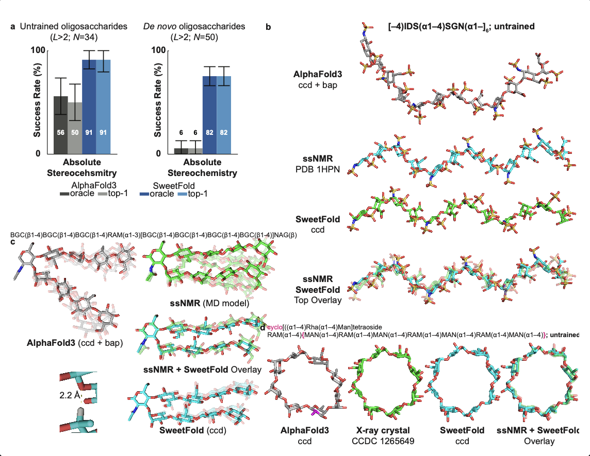
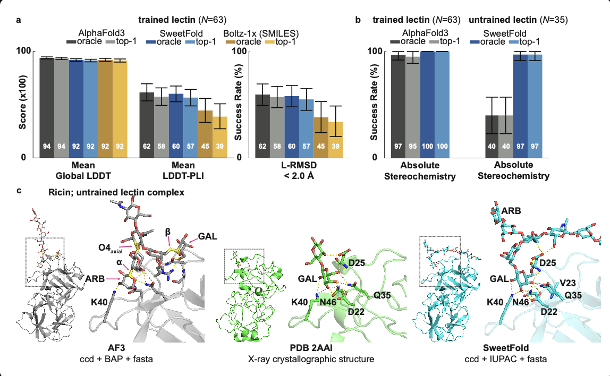
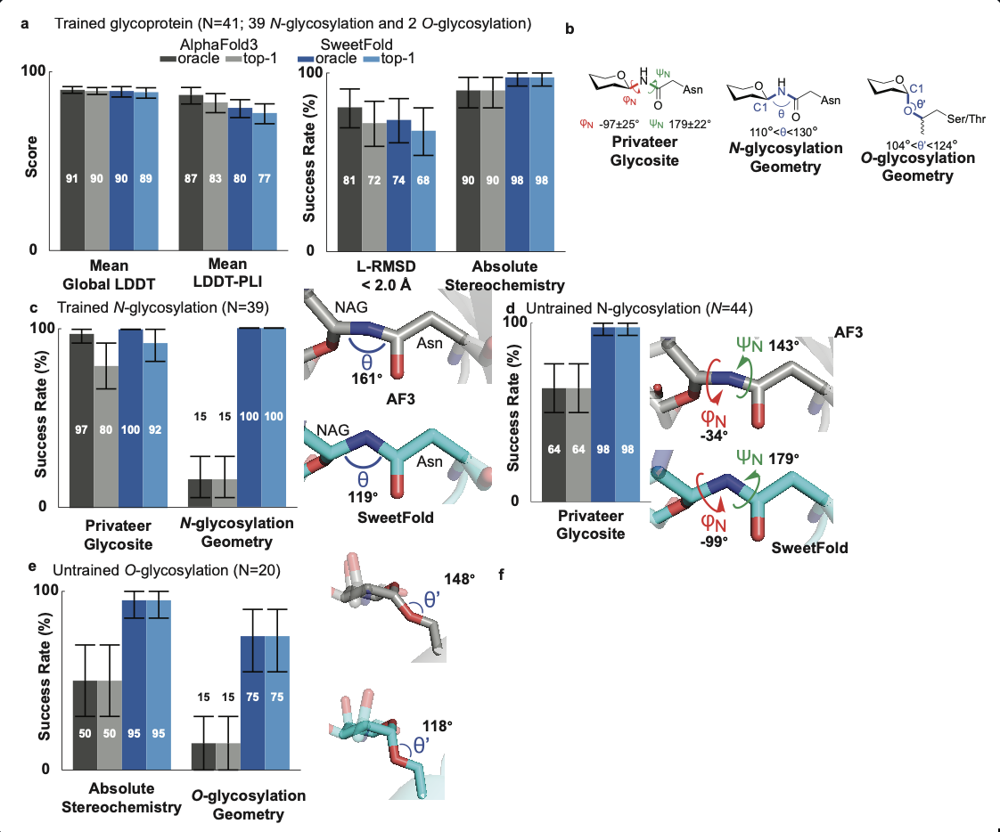

## Glycan-focused Structure Prediction in Boltz-1x

File Structure:
- The colab folder contains files used for google colab inference
- The instructions folder contains comprehensive instructions on how to run inference, preprocessing, and training. The inference folder provides example YAML files and an example script for predicting glycans with the proper IUPAC sequence nomenclature. The preprocessing folder provide instructions on how to generate, clean, and featurize molecular structures containing glycans. The training folder provides instructions on how to train SweetFold, as well as the specific hyperparameters used during training
- The src folder contains the full SweetFold source code, containing unchanged files from Boltz-1x, as well as updated SweetFold files that are required to correctly run the model
  

------------------
SweetFold Benchmarks:

  
  
  

